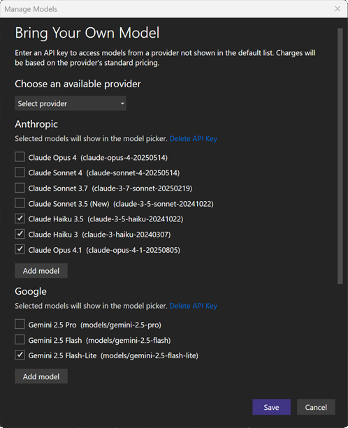

You can now connect your own language models to Visual Studio Chat, giving you more choice, control, and customization over your AI experience.

Use API keys from **Anthropic**, **Google**, or **OpenAI** to try the latest releases, run models that meet your security or performance needs, and switch easily between built-in and custom options.

**Getting started:**
1. Open the **Chat Window** > Select **Manage Models** from the model picker > add your provider and key.

> Available for Chat only. Not supported for Copilot Business or Enterprise. Model capabilities vary.

More providers and features are coming soon, helping you build with the AI that works best for you.

### Want to try this out?
Activate GitHub Copilot Free and unlock this AI feature, plus many more.
No trial. No credit card. Just your GitHub account. [Get Copilot Free](https://github.com/settings/copilot).
