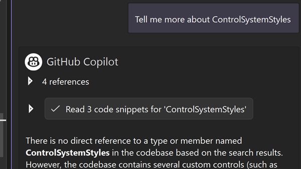

Copilot Chat keeps getting smarter with improved context for your everyday tasks. You can expect better overall responses since the core code search capabilities have been enhanced to provide more relevant results. Now, Copilot is even better at retrieving the right code snippets related to behaviors, concepts, or functionality described in natural language. These improvements are thanks to leveraging remote indexes of your codebases. 

### Want to try this out?
Activate GitHub Copilot Free and unlock this AI feature, plus many more.
No trial. No credit card. Just your GitHub account. [Get Copilot Free](https://github.com/settings/copilot).
