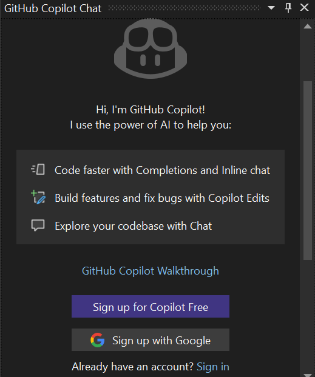

New to Copilot? You can now sign up for Copilot using your Google account!

GitHub now supports social login with Google, and you can link your new account right from Visual Studio. 

Click the **Sign up with Google** button from the Copilot Chat window to streamline your Copilot set up with your Google account!

### Want to try this out?
Activate GitHub Copilot Free and unlock this AI feature, plus many more.
No trial. No credit card. Just your GitHub account. [Get Copilot Free](https://github.com/settings/copilot).
