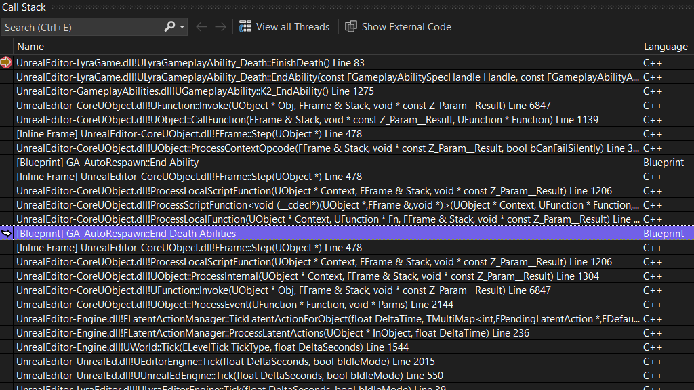
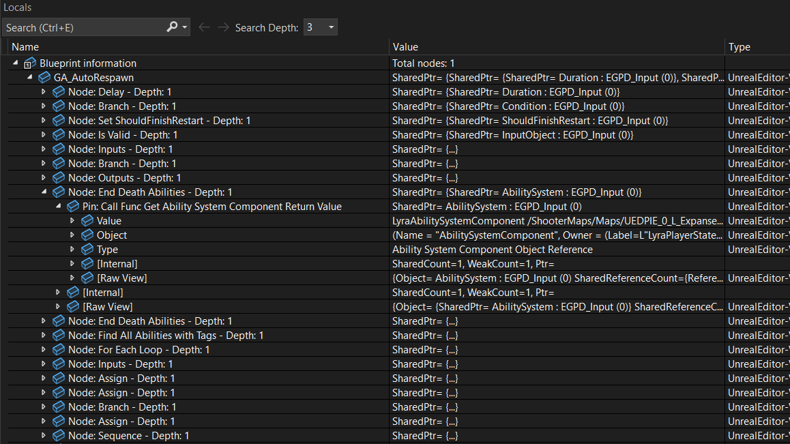

We are happy to announce enhanced debugging support for Unreal Engine projects. Visual Studio will now display Blueprint information directly in the call stack and local variables windows. 

This update allows you to debug Blueprint and C++ code together in a single session, making it easier to trace interactions and identify issues across both scripting layers. In addition, you can now set breakpoints in Blueprint code, providing a more integrated debugging experience.

