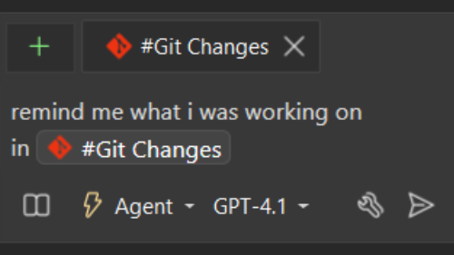
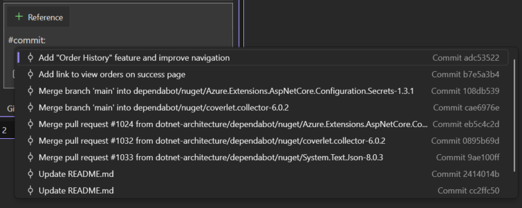

Copilot Chat now supports referencing your commits and changes in the Git Changes window. You can ask Copilot to summarize your changes, explain a specific commit, and more!

### Reference your changes
`#changes` looks at your uncommitted changes. For example, you can ask Copilot to remind you of what you've done so far by referencing your `#changes`.

### Reference your commits
When you start typing `#commit:`, Copilot will pull up a list of the most recent commits for you to select from. If there's an older commit you want to reference, you can also reference its specific commit id. 

Then you can ask the chat to use the commit for tasks like "write unit tests to cover changes in this commit" or "find potential issues in this commit".

### Try this out
Ensure the following feature flag is turned on to be able to use these references: **Tools** > **Options** > **GitHub** > **Copilot** > **Source Control Integration** > **Enable Git preview features**.
