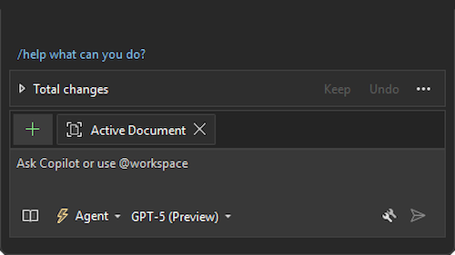

We're excited to share that GPT-5 has landed in Visual Studio for everyone. It's snappier and even better at helping you read, write, and refactor code. We can't wait to see what you build with it.

Just click the Copilot badge in your IDE, open chat, and pick **GPT-5 (Preview)** to try it out.

### Want to try this out?
Activate GitHub Copilot Free and unlock this AI feature, plus many more.
No trial. No credit card. Just your GitHub account. [Get Copilot Free](https://github.com/settings/copilot).
