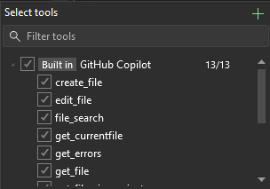
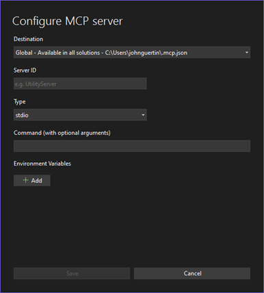
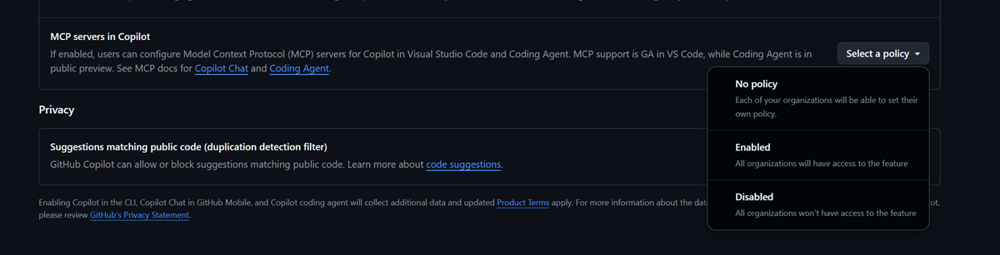

We are excited to announce that MCP support is now GA in Visual Studio! Expand the power of agent mode through rich, real-time context from your whole development stack.

Model Context Protocol (MCP) is a protocol designed to seamlessly connect AI agents with a variety of external tools and services, similar to how HTTP standardized web communication. The aim is to enable any client to integrate robust tool servers such as databases, code search, and deployment systems, without writing custom connections for each tool. 

With our GA announcement, we are bringing a whole new set of exciting features, with even more soon on the way, to make MCP easier than ever before to access and manage server configurations. 

### Full Authentication Specification support for remote servers (with any OAuth provider)

VS now supports the new MCP authorization specification, meaning that OAuth support is now included for any and all OAuth providers. Previously, Visual Studio supported authentication for remote servers through integration with the VS Keychain. Now, in the August release of VS, authentication with any OAuth provider is supported for remote MCP servers. Just simply select **Manage Authentication** for any server from the CodeLens in the .mcp.json file, and you will be redirected to a browser pop-up to easily provide your credentials for the necessary OAuth provider for that server. 

### Easier ways to add new MCP servers

With the GA release of MCP in VS, we're adding two new ways to add connections to new MCP servers. No more need to copy and paste JSON snippets manually into a .mcp.json file. MCP support is now truly a first-class experience in VS with these new features: 

**One-click install from the web**

Have you ever noticed buttons in MCP server repos that say 'Install in VS Code', and wondered when support for this simple functionality would come to VS? Well your questions have been answered! Visual Studio now supports one-click server installation from the web. With this new functionality, adding new MCP servers in VS is as simple as the click of a button. Be on the lookout for **Install in VS** buttons to start appearing in the repos for your favorite MCP servers!
If you would like to add a button like this to your own MCP server repo, or you notice one missing from your favorite public server repo, you can create one using the following protocol handler template: vsweb+mcp:/install, followed by the server metadata.

**Add server UI flow**

We've made it easier than ever to add connections to new MCP servers with our new add flow. Whether it's a server you found online, or a custom built MCP server for your organization, you no longer need to manually copy, paste, and configure JSON to connect to new servers. To access this flow, simply click the new green plus button icon in the tool picker window in GitHub Copilot Chat. 

Simply specify the name of the server, the input method, any arguments, or URL for HTTP servers, and seamlessly add the connection.

### MCP Governance policy support
We understand that organizations may have different policies and through a new integration with GitHub policy, enterprises and organizations can now have fine grained control over access to MCP functionality within their organizations. Your IT admin can now simply navigate to your GitHub policy settings, and toggle on or off MCP features for all users. 

### Want to try this out?
Activate GitHub Copilot Free and unlock this AI feature, plus many more.
No trial. No credit card. Just your GitHub account. [Get Copilot Free](https://github.com/settings/copilot).
