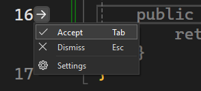

Want to be focused when coding and not seeing next edit suggestions (NES) popping up automatically? We hear you that sometimes Copilot suggestions can be a bit distracting when appearing unexpectedly, and now in Visual Studio you can hide NES by default and only review them when you want to.

NES will still be triggered based on your edits and when there is an available NES ready for you to review, a **margin indicator** will pop up in the gutter space, pointing at the line that it has a suggestion for. To view this suggestion, you can either:

1) Click the margin indicator or
2) Press `Tab` key

and the suggestion will be displayed. Then, after viewing the suggestions, you can press `Tab` again to accept it or press `ESC` to dismiss it. After you accept a suggestion, any related suggestions will automatically appear again, as you might find them useful too. Any other new suggestions that are not related to your previously accepted suggestion will be hidden again.

For example, in the video below, after changing `Point` to `Point3D`, a NES is available but not displayed directly. The margin indicator and hint bar shows that there is a suggestion on line 4 and then I clicked on the indicator to review it.

To try out this experience, go to **Tools > Options > GitHub > Copilot > Copilot Completions** and check **Collapse Next Edit Suggestions**.

You can also configure it via the shortcut provided by the context menu in the margin indicator. Whenever there is a code suggestion ready for you in the Editor (no matter it's from Copilot or IntelliCode), a margin indicator will pop up and point at the corresponding line. When clicking on the indicator, a context menu will appear, giving you multiple ways to interact with the code suggestion:
  - Accept (click **Accept** or press `Tab`)
  - Dismiss (click **Dismiss** or press `ESC`)
  - Settings: You can open the GitHub Copilot Completions settings page directly from here.

Please let us know in Developer Community if you have any feedback!

### Want to try this out?
Activate GitHub Copilot Free and unlock this AI feature, plus many more.
No trial. No credit card. Just your GitHub account. [Get Copilot Free](https://github.com/settings/copilot).
